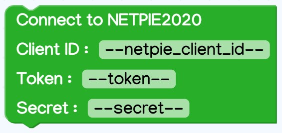

# NX2002 Kidbright
### การติดตั้ง
1. ติดตั้ง KBIDE
2. เปิดโปรแกรม KBIDE จากนั้น เลือกเมนู Board Manager
3. ค้นหาบอร์ด โดยพิมพ์คำว่า 'NX2002' จากนั้นให้ทำการดาวน์โหลดบอร์ด

> หมายเหตุ : หากไม่สามารถดาวน์โหลดผ่าน Board Manager ใน KBIDE ได้ ให้ทำการดาวน์โหลดจาก https://github.com/chp-lab/nx2002-kidbright แทน จากนั้นให้ Extract zip ไฟล์และนำโฟลเดอร์ของบอร์ด(เปลี่ยนชื่อ folder ที่ได้เป็น nx2002 ก่อน) ไปวางที่ Board folder ของ KBIDE (สามารถเปิด Board folder ของ KBIDE โดยการเลือกเมนู File > Open Board folder)

### การเรียกใช้งาน
1. เลือกเมนู Board Manager
2. เลือก NX2002 Board แล้วกด Change Board

### Block ภายใน NX2002 Kidbright
เมื่อเลือกใช้งาน NX2002 Board ภายในจะมี Block สำหรับการใช้งาน NX2002 และ NETPIE2020 เพิ่มขึ้นมาโดยแต่ละ Block จะมีการทำงานดังนี้

## NX2002 Block

#### Using NX2002 RGB : เป็น Block สำหรับประกาศการเริ่มใช้งาน RGB LED บน NX2002

#### Set RGB Color : เป็น Block สำหรับตั้งค่าสี RGB LED บน NX2002

#### RGB LED Status : เป็น Block สำหรับควบคุม RGB LED (on/off)

#### RGB LED Color : เป็น Block สำหรับตั้งค่าสีให้กับ RGB LED โดยเลือกสีที่ต้องการแสดงได้

#### Using NX2002 I2C port : เป็น Block สำหรับประกาศการเริ่มใช้งาน NX2002 I2C port

#### Number of connected I2C device : เป็น block สำหรับ scan หาจำนวน I2C device ที่เชื่อมต่ออยู่กับ NX2002

#### Has I2C device at address : เป็น block สำหรับ check ว่ามี I2C device อยู่ที่ address ที่ระบุหรือไม่

#### Using NX2002 SPI port : เป็น block สำหรับประกาศเริ่มใช้งาน NX2002 SPI port

#### Using NX2002 built-in button : เป็น block สำหรับประกาศเริ่มใช้งาน NX2002 built-in button

## NETPIE2020 Block

#### Connect to NETPIE2020 : เป็น block สำหรับเชื่อมต่อ NETPIE2020 โดยผู้ใช้งานต้องกรอก client id, token, secret ที่ generate มาจากการสร้าง device ใน NETPIE2020

#### Callback : เป็น block สำหรับจัดการ message ที่เข้ามาจาก NETPIE2020
 

#### Subscribe topic : เป็น block สำหรับ subscribe เพื่อรอรับ message จาก NETPIE2020

#### Unsubscribe topic : เป็น block สำหรับ unsubscribe เพื่อรอรับ message จาก NETPIE2020

#### Publish Message : เป็น block สำหรับ publish message ไปยัง NETPIE2020

#### Update Shadow : เป็น block สำหรับ update shadow บน NETPIE2020

#### Reconnect NETPIE2020 : เป็น block สำหรับทำการ reconnect NETPIE2020

#### NETPIE Client loop : เป็น block สำหรับคงสถานะการเชื่อมต่อกับ NETPIE2020

#### NETPIE2020 is connected : เป็น block สำหรับเช็คสถานะการเชื่อมต่อกับ NETPIE2020 โดยจะ return ค่าเป็น boolean (True = ยังคงเชื่อมต่อ, False = ขาดการเชื่อมต่อ)

#### Key-Value : เป็น block สำหรับสร้างข้อมูลที่จะไปอัพเดท shadow ของ NETPIE2020 (ใช้กับ Update Shadow block)

#### topic : เป็น block ตัวแปร topic (ใช้ใน callback block)

#### payload : เป็น block ตัวแปร payload (ใช้ใน callback block)
